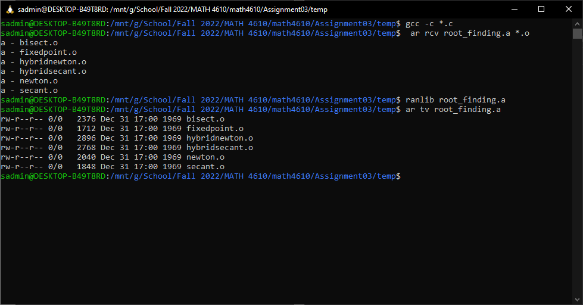

# Math 4610 Tasksheet 3
### Jacob Fitzgerald (A02261889)

## Links
### Code
https://jfitzusu.github.com/math4610/
### Docs
https://jfitzusu.github.io/math4610/

## Task 1
### Bisection Method
```
#include <stdio.h>
#include <stdlib.h>
#include <math.h>

/**
* Returns the Root Approximation of a Function Using the Bisection Method
* *f(): Function to Find Root Of
* a: Lower Bound to Search
* b: Upper Bound to Search
* tol: Maximum Permissable Error 
* Returns: Approximation of Root
*/
double bisect(double (*f)(), double a, double b, double tol) {
        double fa = f(a);
        double fb = f(b);

        // Invalid Boundaries
        if (fa * fb >= 0.0) {
            printf("There may not be a root in [a,b]: f(a) * f (b) = %e", fa*fb);
            exit(-1);
        }

        double c;
        double fc;

        // Iterations Needed to Reach Tolerance
        int k = ((int) (log(tol) - log(b - a)) / log(0.5) + 1);

        for (int i=0; i<k;i++) {
            c = 0.5 * (a + b);
            fc = f(c);

            // Root in First Half
            if (fa * fc < 0.0) {
                b = c;
                fb = fc;
            
            }

            // Root in Second Half
            else if (fb * fc < 0.0) {
                a = c;
                fa = fc;
            }

            else if (fc == 0) {
                return c;
            }
        }

        return c;
    }
```

### Fixed Point Iteration
```
#include <stdio.h>
#include <stdlib.h>
#include <math.h>

/**
* Approximates the Root of a Function Using Fixed Point Iteration
* *g(): The Modified, Fixed Point Form of the Function
* x0: Initial Approximation
* tol: Maximum Permissable Error
* maxIterations: Maximum Times to Try for Convergence
* Returns: Approximation of Root
*/
double fixedPoint(double (*g)(), double x0, double tol, int maxIterations) {
        double x1;
        for (int i=0; i<maxIterations; i++) {
            x1 = g(x0);

            // Root is Within Permissable Error
            if (fabs(x1 - x0) <= tol) {
                break;
            }
            x0 = x1;
        }

        return x1;
    }

```

### Newton's Method
```
#include <stdio.h>
#include <stdlib.h>
#include <math.h>

/**
* Approximates Root of Function Using the Newton Method
* *f(): Function to Find Root In
* *g(): Derivitive of f()
* x0: Initial Guess
* tol: Maximum Permissible Error
* maxIterations: Maximum Times to Try for Convergence
* Returns: Approximation of Root
*/
double newton(double (*f)(), double(*g)(), double x0, double tol, int maxIterations) {
        double x1;
        double gx;

        for (int i=0; i<maxIterations; i++) {
            gx = g(x0);

            // Newton Method Fails, Slope of Function is Flat
            if (gx == 0) {
                printf("Encountered Invalid Derivitaive Value at X = %e", x0);
                exit(-1);
            }

            x1 = x0 - f(x0) / gx;

            // Root Within Permissible Error
            if (fabs(x1 - x0) <= tol) {
                break;
            }
            
            x0 = x1;
        }

        return x1;
    }

```

### Secant Method
```
#include <stdio.h>
#include <stdlib.h>
#include <math.h>

/**
* Approximates the Root of a Function Using the Secant Method
* *f(): Function to Approximate Root For
* x0: Initial Guess
* x1: Second Initial Guess
* tol: Maximum Permissable Error
* maxIterations: Maximum Times to Try for Convergence
* Reutnrs: Approximation of Root
*/
double secant(double (*f)(), double x0, double x1, double tol, int maxIterations) {
        double f0 = f(x0);
        double f1 = f(x1);
        double x2 = 0;

        for (int i=0; i<maxIterations; i++) {
            x2 = x1 - f1 * (x1 - x0) / (f1 - f0);

            // Root Within Permissible Error
            if (fabs(x2 - x1) <= tol) {
                break;
            }

            x0 = x1;
            x1 = x2;
            f0 = f1;
            f1 = f(x1);
        }

        return x2;
    }

```

### Hybrid Newton's Method
```
#include <stdio.h>
#include <stdlib.h>
#include <math.h>
#include <stdbool.h>

/**
* Approximates the Root of a Function Using the  and Bisection Methods
* *f(): Function to Approximate Root For
* a: Miminum Value of Range to Search
* b: Maximum Value of Range to Serach
* tol: Maximum Permissable Error
* maxIterations: Maximum Times to Try for Convergence
* maxTries: Maximum Times to Reduce Interval
* strictInterval: If the Function Should Only Reutn rValues Wihtin the Interval
* Returns: Approximation of Root
*/
double hybridNewton(double (*f)(), double (*g)(), double a, double b, double tol, int maxIterations, int maxTries, bool strictInterval) {

        double x2 = 0;
        double x0 = b;
        double x1 = 0;
        double f0 = f(x0);
        double f1 = f(x1);
        double gx;
        double error;

        for (int i=0; i<maxTries; i++) {
            
            // Initial Conditions for Newton Appromxiation
            x0 = b;
            x1 = 0;
            
            

            // Newton Approxmiation
            for (int j=0; j<maxIterations; j++) {
                gx = g(x0);
                if (gx == 0) {
                    printf("Encountered Invalid Derivitaive Value at X = %e", x0);
                    exit(-1);
                }
                
                x1 = x0 - f(x0) / gx;
                error = fabs(x1 - x0);

                if (error <= tol) {
                    break;
                }

                x0 = x1;
            }

            // Only Returns Results Outisde the Interval if StrictInterval is Off
            if (strictInterval) {
                if (error < tol && x1 < b && a < x1) {
                    return x1;
                }
            }
            else if (error < tol) {
                    return x1;
            }

            // Setup for Bisection
            double fa = f(a);
            double fb = f(b);
            double c;
            double fc;

            // Uses Bisection to Reduce Interval Size if Newton Fails
            for (int j = 0; j < 4; j++) {
                c = 0.5f * (a + b);
                fc = f(c);

                if (fa * fc < 0) {
                    fb = fc;
                    b = c;
                }

                else if (fb * fc < 0) {
                    fa = fc;
                    a = c;
                }

                else if (fc == 0) {
                    return c;
                }

                else {
                    printf("There may not be a root in [a,b]: f(a) * f (b) = %e", fa*fb);
                    exit(-1);
                }
            }

            if (fabs(b - a) <= tol) {
                return b;
            }
        }

        return b;
    }

```

### Hybrid Secant Method
```
#include <stdio.h>
#include <stdlib.h>
#include <math.h>
#include <stdbool.h>

/**
* Approximates the Root of a Function Using the Secant and Bisection Methods
* *f(): Function to Approximate Root For
* a: Miminum Value of Range to Search
* b: Maximum Value of Range to Serach
* tol: Maximum Permissable Error
* maxIterations: Maximum Times to Try for Convergence
* maxTries: Maximum Times to Reduce Interval
* strictInterval: If the Function Should Only Reutn rValues Wihtin the Interval
* Returns: Approximation of Root
*/
double hybridSecant(double (*f)(), double a, double b, double tol, int maxIterations, int maxTries, bool strictInterval) {
        double x0 = b;
        double x1 = 0;
        double f0 = f(x0);
        double f1 = f(x1);
        double x2;
        double error;

        for (int i=0; i<maxTries; i++) {
            
            // Initial Conditions for Secant Appromxiation
            x0 = b;
            x1 = 10 * tol + x0;
            f0 = f(x0);
            f1 = f(x1);

            // Secant Approxmiation
            for (int j=0; j<maxIterations; j++) {
                x2 = x1 - f1 * (x1 - x0) / (f1 - f0);
                
                error = fabs(x2 - x1);
                if (error <= tol) {
                    break;
                }

                            x0 = x1;
                x1 = x2;
                f0 = f1;
                f1 = f(x1);
            }

            // Only Returns Results Outisde the Interval if StrictInterval is Off
            if (strictInterval) {
                if (error < tol && x1 < b && a < x1) {
                    return x1;
                }
            }
            else if (error < tol) {
                    return x1;
            }

            // Setup for Bisection
            double fa = f(a);
            double fb = f(b);
            double c;
            double fc;

            // Uses Bisection to Reduce Interval Size if Secant Fails
            for (int j = 0; j < 4; j++) {
                c = 0.5f * (a + b);
                fc = f(c);

                if (fa * fc < 0) {
                    fb = fc;
                    b = c;
                }

                else if (fb * fc < 0) {
                    fa = fc;
                    a = c;
                }

                else if (fc == 0) {
                    return c;
                }

                else {
                    printf("There may not be a root in [a,b]: f(a) * f (b) = %e", fa*fb);
                    exit(-1);
                }
            }

            if (fabs(b - a) <= tol) {
                return b;
            }
        }

        return b;
    }

```

## Task 2
Code for Testing:
```
#include <stdio.h>
#include <stdlib.h>
#include <math.h>
#include <stdbool.h>
#include "../src/bisect.c"
#include "../src/newton.c"
#include "../src/secant.c"
#include "../src/fixedpoint.c"
#include "../src/hybridnewton.c"
#include "../src/hybridsecant.c"


double fval(double);
double gval(double);
double fprimeval(double);

int main() {
    printf("Bisection Root: %f \n", bisect(fval, -3.9, 4, 0.0001));
    printf("Fixed Point Root: %f \n", fixedPoint(gval, -0.1, 0.0001, 100));
    printf("Newton Root: %f \n", newton(fval, fprimeval, 0, 0.0001, 100));
    printf("Secant Root: %f \n", secant(fval, 0, 1, 0.0001, 100));
    printf("Hybrid Newton Root: %f \n", hybridNewton(fval, fprimeval, -3.9, 4, 0.0001, 100, 10, true));
    printf("Hybrid Secant Root: %f \n", hybridSecant(fval, -3.9, 4, 0.0001, 100, 10, true));

}

double fval(double xval) {
    return xval * exp(-xval);
}

double gval(double xval) {
    return xval - fval(xval);
}

double fprimeval(double xval) {
    return exp(-xval) - xval * exp(-xval); 
}
```

Results of Running the Code:
```
Bisection Root: -0.000026
Fixed Point Root: 0.000000
Newton Root: 0.000000
Secant Root: 0.000000
Hybrid Newton Root: -0.000000
Hybrid Secant Root: 0.000000
```


## Task 3
Code is the same as in task 2.
Result is also the same.

## Task 4
Console Output:
```
sadmin@DESKTOP-B49T8RD:/mnt/g/School/Fall 2022/MATH 4610/math4610/Assignment03/temp$ gcc -c *.c
sadmin@DESKTOP-B49T8RD:/mnt/g/School/Fall 2022/MATH 4610/math4610/Assignment03/temp$  ar rcv root_finding.a *.o
a - bisect.o
a - fixedpoint.o
a - hybridnewton.o
a - hybridsecant.o
a - newton.o
a - secant.o
sadmin@DESKTOP-B49T8RD:/mnt/g/School/Fall 2022/MATH 4610/math4610/Assignment03/temp$ ranlib root_finding.a
sadmin@DESKTOP-B49T8RD:/mnt/g/School/Fall 2022/MATH 4610/math4610/Assignment03/temp$ ar tv root_finding.a
rw-r--r-- 0/0   2376 Dec 31 17:00 1969 bisect.o
rw-r--r-- 0/0   1712 Dec 31 17:00 1969 fixedpoint.o
rw-r--r-- 0/0   2896 Dec 31 17:00 1969 hybridnewton.o
rw-r--r-- 0/0   2768 Dec 31 17:00 1969 hybridsecant.o
rw-r--r-- 0/0   2040 Dec 31 17:00 1969 newton.o
rw-r--r-- 0/0   1848 Dec 31 17:00 1969 secant.o
sadmin@DESKTOP-B49T8RD:/mnt/g/School/Fall 2022/MATH 4610/math4610/Assignment03/temp$
```
Screenshot:


## Task 5
Results of Running Newly Compiled Tests:
```
Bisection Root: -0.000026
Fixed Point Root: 0.000000
Newton Root: 0.000000
Secant Root: 0.000000
Hybrid Newton Root: -0.000000
Hybrid Secant Root: 0.000000
```