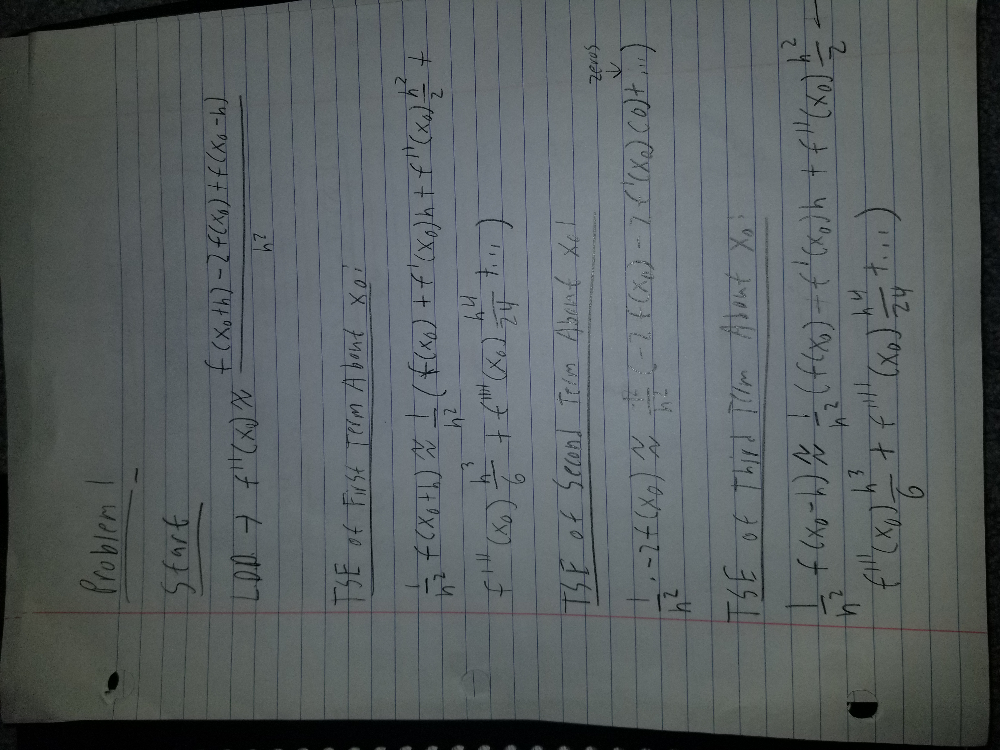
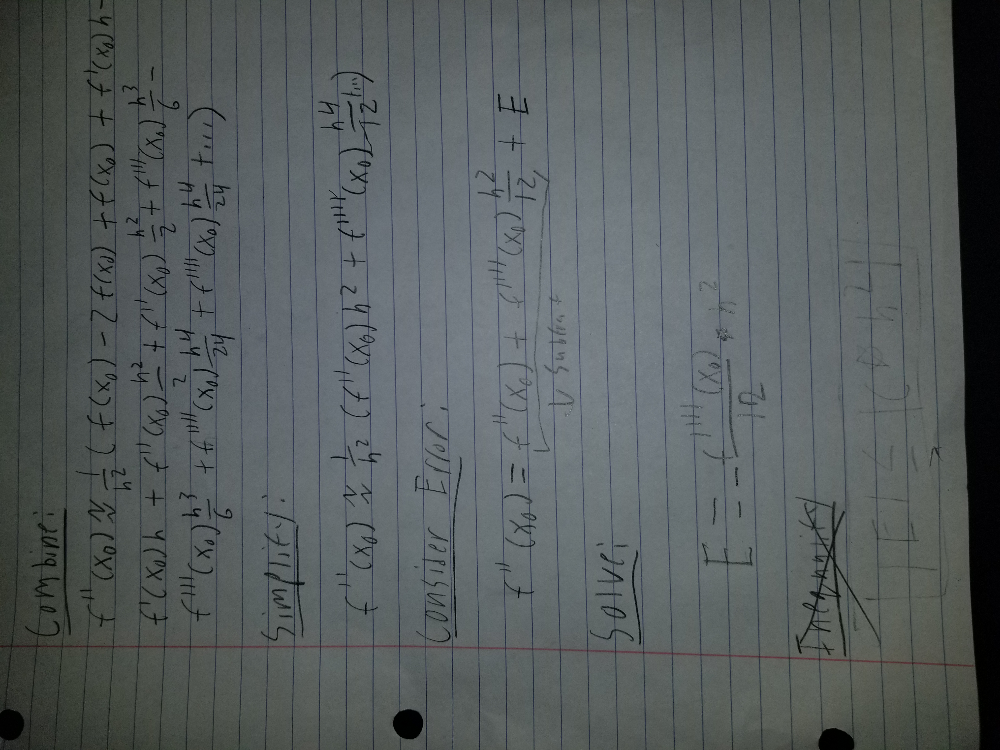
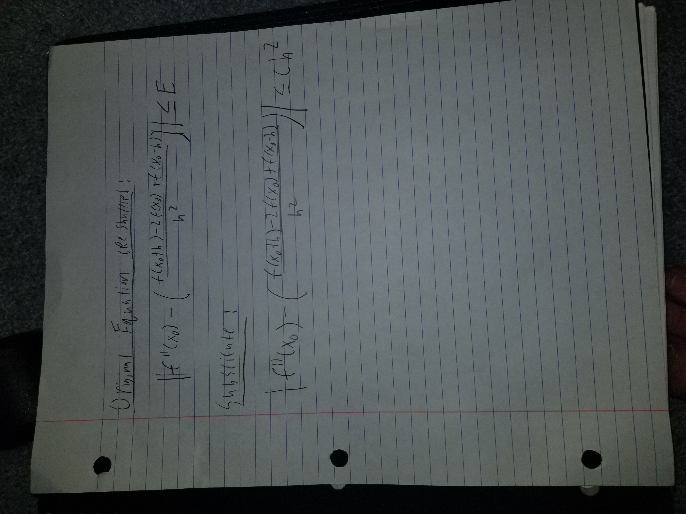
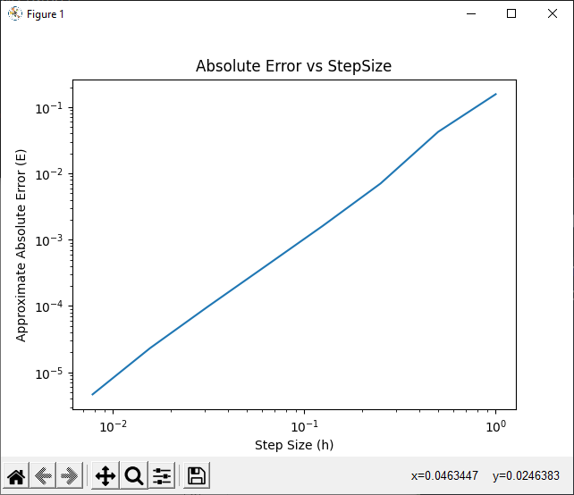
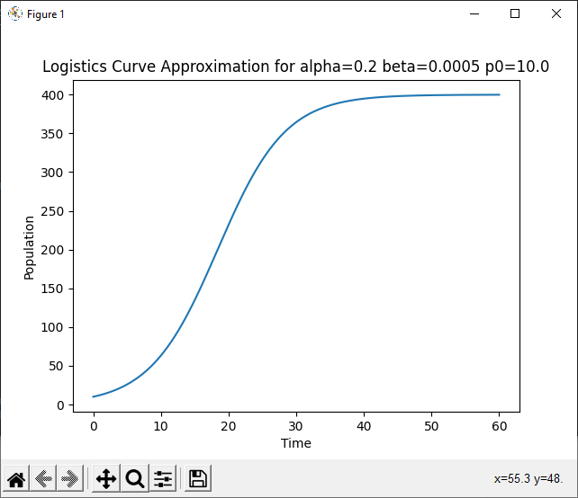
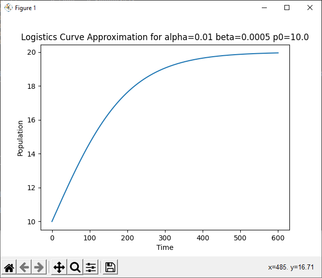
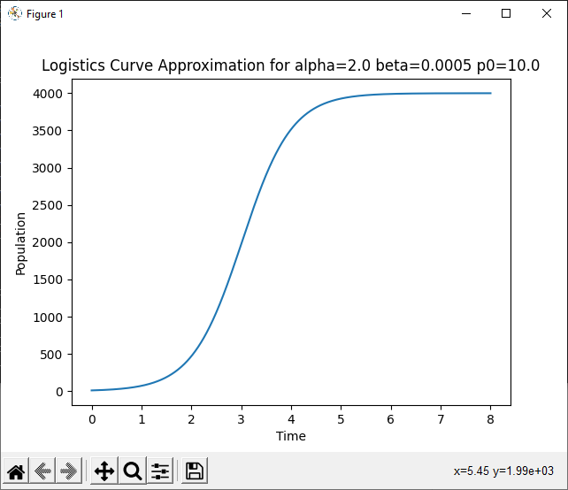

# Math 4610 Tasksheet 4
### Jacob Fitzgerald (A02261889)

## Links
### Code
https://github.com/jfitzusu/math4610
### Docs
https://jfitzusu.github.io/math4610/

All source code can be found under assignment04/src.

## Task 1




## Task 2
### Implementation Code
```
"""
Function Which Uses the Limit Definition of the Derivative to Approximate the Value of the Second Derivative of a Function
f: Function to Approximate For
x0: Point to Approximate At
h: Initial Increment
Returns: Approximate Value of Second Derivative
"""
def approxSecondDerivative(f, x0, h):
    return (f(x0 + h) - 2 * f(x0) + f(x0 - h)) / (h * h)
```

This code impliments the limit definition of the derivative to approximate the value of the second derrivative of an arbitrary function at an arbitrary value.

### Testing Code
```
def testSecondDerivative():
    testFunction = lambda x: ((x - math.pi / 2) * math.tan(x) ** 2) / (x * x + 65)

    print("Testing Function:  ((x - PI / 2) * tan(x) ** 2) / (x * x + 65) at x0 = PI / 4")
    for i in range(7):
        h = 1 / (2 ** i)
        print(f"    With Step Size {h:.4f}: ", end='')
        print(f"{approxSecondDerivative(testFunction, math.pi / 4, h): .10f}")
    print("\n\n")
```

#### Output
```
Testing Function:  ((x - PI / 2) * tan(x) ** 2) / (x * x + 65) at x0 = PI / 4
    With Step Size 1.0000:  0.0888843331
    With Step Size 0.5000: -0.1099994234
    With Step Size 0.2500: -0.0747243947
    With Step Size 0.1250: -0.0693044446
    With Step Size 0.0625: -0.0680767520
    With Step Size 0.0312: -0.0677769924
    With Step Size 0.0156: -0.0677024890
```

As you can see, the approximation converges very rapidly as the step size halves. Without looking at errors, it's not quite possible to say that the error decreases with h^2, but it does look like it. Either way, this is a good indication our function is working as intended.

## Task 3
### Implementation Code
```
"""
Function to Apply Linear Regression to a Set of Points
X: Array of X Values (Input)
Y: Array of Y Values (Output) (Must Match x in Size)
returns: a and b, the Approximate Coefficients of the Equation y = ax + b
"""


def linearFit(X, Y):
    assert len(X) == len(Y);
    n = len(X)

    # A Matrix After Transposition Step
    a11 = n
    a12 = sum(X)
    a21 = a12
    a22 = sum([xi * xi for xi in X])

    # B Matrix After Transposition Step
    b1 = sum(Y)
    b2 = sum([X[i] * Y[i] for i in range(n)])

    # Determinant of Modified A Matrix
    detA = a11 * a22 - a12 * a21

    # Results After Elimination Step
    b = (a22 * b1 - a12 * b2) / detA
    a = (-a21 * b1 + a11 * b2) / detA

    return a, b

```

This function approximates a linear fit for two arrays of values, one input, one output. It utilizes matrix algebra to solve for the unknown values a and b, such that y = ax + b, and returns them. 

### Testing Code
```
def testLinearRegression():
    print("Approximating Linear fit For ((x - PI / 2) * tan(x) ** 2) / (x * x + 65) at x0 = PI / 4")
    testFunction = lambda x: ((x - math.pi / 2) * math.tan(x) ** 2) / (x * x + 65)

    X = [1 / (2 ** i) for i in range(9)]
    Y = [approxSecondDerivative(testFunction, math.pi / 4, xi) for xi in X]

    print("    Error Analysis")
    E = Y[:-1]
    for i in range(len(Y) - 1):
        E[i] = abs(Y[-1] - Y[i])
        print(f"        Error With Step Size {X[i]:.4f}: {E[i]:.10f}")

    logX = [math.log(x) for x in X[:-1]]
    logE = [math.log(e) for e in E]

    # SciPy's Built in Linear Regression Function
    slope1, intercept1, _, _, _ = stats.linregress(logX, logE)

    # My Linear Regression Function
    a, b = linearFit(logX, logE)

    print(f"    Equation Using Scipy Linear Regression: E = {math.exp(intercept1):0.4f} * h ^ {slope1:.4f}")
    print(f"    Equation Using My Linear Regression: E = {math.exp(b):0.4f} * h ^ {a:.4f}")
    print("\n\n")

    # Graph of Error
    plt.plot(X[:-1], E)
    plt.title("Absolute Error vs StepSize")
    plt.xlabel("Step Size (h)")
    plt.ylabel("Approximate Absolute Error (E)")
    plt.yscale('log')
    plt.xscale('log')
    plt.show()
```

#### Output
```
Approximating Linear fit For ((x - PI / 2) * tan(x) ** 2) / (x * x + 65) at x0 = PI / 4
    Error Analysis
        Error With Step Size 1.0000: 0.1565635754
        Error With Step Size 0.5000: 0.0423201811
        Error With Step Size 0.2500: 0.0070451524
        Error With Step Size 0.1250: 0.0016252022
        Error With Step Size 0.0625: 0.0003975097
        Error With Step Size 0.0312: 0.0000977500
        Error With Step Size 0.0156: 0.0000232467
        Error With Step Size 0.0078: 0.0000046480
    Equation Using Scipy Linear Regression: E = 0.1568 * h ^ 2.1426
    Equation Using My Linear Regression: E = 0.1568 * h ^ 2.1426
```


This code computes the linear best fit for the log/log data from problem 2. As you can see, the log/log graph of step size vs error appears to be linear, implying a geometric relationship between the two. Using our linear regression function, we can see that the error is approximately proportional to h ^ 2.14, which is extremely close to h^2, our predicted value. Surprisingly, our function returns exactly the same values as scipy's built in linear regression function, which makes me believe they use the exact same algorithm. 


## Task 4
### Abs Error Code
```
#include <stdio.h>
#include <stdlib.h>
#include <math.h>

/**
* Caclulates the Absolute Error Given a Value and It's Approximation
* u: True Value
* v: Approximation
* Returns: Absolute Error of Approximation
*/
double absError(double u, double v) {
        return fabs(v - u);
    }
```

This code, written in C, calculates the absoulte error of an estimate given the correct value.

### Rel Error Code
```
#include <stdio.h>
#include <stdlib.h>
#include <math.h>

/**
* Caclulates the Absolute Error Given a Value and It's Approximation
* u: True Value
* v: Approximation
* Returns: Absolute Error of Approximation
*/
double relError(double u, double v) {
        return fabs((v - u) / u);
    }

```

This code, written in C, calculates the relative error of an estimate given the correct value.

### Double Accuracy Code
```

#include <stdio.h>
#include <stdlib.h>
#include <math.h>

/**
* Caclulates the Accuracy of A Double (in Bits)
* Returns: The Number of Digits of Accuracy a Double is Capable of Displaying
*/
int accuracyDouble(int maxLoops) {
        double one = 1.0f;
        double modifier = 1.0f;

        for (int i=0; i < maxLoops; i++) {
            if (one - (one + modifier) == 0) {
                return i;
            }
            modifier /= 2.0f;
        }

        return -1;
    }


```

This code, written in C, shows how many (binary) digits of accuracy a double has in C.

### Single Accuracy Code
```
/**
* Caclulates the Accuracy of A Single
* Returns: The Number of Digits of Accuracy a Single is Capable of Displaying
*/
int accuracySingle(int maxLoops) {
        float one = 1.0f;
        float modifier = 1.0f;

        for (int i=0; i < maxLoops; i++) {
            if (one - (one + modifier) == 0) {
                return i;
            }
            modifier /= 2.0f;
        }

        return -1;
    }
```

This code, written in C, shows how many (binary) digits of accuracy a single (float) has in C.

### Shared Library
Shared libraries can be found at https://github.com/jfitzusu/math4610/tree/main/Assignment04/shared.
error_calculation.a -> Error Calculation Library
accuracy.a -> Floating Point Accuracy Library

### Testing Code
```
#include <stdio.h>
#include <stdlib.h>
#include "accuracysingle.c"
#include "accuracydouble.c"
#include "abserror.c"
#include "relerror.c"


int main() {
        printf("Relative Error of %f to %f: %f \n", 10.1, 10.0, relError(10.0, 10.1));
        printf("Absolute Error of %f to %f: %f \n", 10.1, 10.0, absError(10.0, 10.1));
        printf("Accuracy of a Single: %i \n", accuracySingle(500));
        printf("Accuracy of a Double: %i \n", accuracyDouble(500));
    }
```

This code runes a simple test of the relative and absoulte error functions, as well as the single and double accuracy functions. We should expecte the abs error of 10.1 relative to 10.0 to be 0.1, and the relative error to be 0.01. Additionally, as c should be using the normal floating point standard, a single should be 24 bits, and a double should be 53.

### Testing Output
```
Relative Error of 10.100000 to 10.000000: 0.010000
Absolute Error of 10.100000 to 10.000000: 0.100000
Accuracy of a Single: 24
Accuracy of a Double: 53
```

As we can see, our results are exactly as expected. Sometimes languages will use funky implementations of singles/doubles, so it's good to see that c uses exactly what you'd expect. Additionally our error functions seem to be working, as we got exactly the results predicted.

## Task 5
### Implementation Code
```
"""
Implements the Explicit Euler Method to Approximate Logistic Curves
a: Alpha, the Growth Constant
b: Beta, the Limiting Constant
p0: Initial Starting Value at t=0
P: The Maximum Value to Approximate
n: Number of Steps to Approximate
Returns: 2 Arrays of Points, One Representing Time Values, the Other Representing P Values
"""


def explicitEulerLogistic(a, b, p0, P, n=100):
    h = P / n
    deriv = lambda x: a * x - b * x * x

    inputs = [0]
    outputs = [p0]

    t = 0
    p = p0
    for i in range(n):
        t += h
        inputs.append(t)
        p = p + h * deriv(p)
        outputs.append(p)

    return inputs, outputs

```

This code uses the explicit Euler method to approximate a logistics curve, with the assumed derivative of alpha * p + beta * p ^ 2. 
Given an alpha, beta, and initial value, as well as a stopping point, it will approximate the curve up to that point, using an optionally configurable number of steps. The more steps used, the smoother and more accurate the curve. 

### Testing Code
```
def testLogistic(a, b, p0, end):
    print(f"Approximating Logistics Equation alpha={a} beta={b} p0={p0}")
    x, y = explicitEulerLogistic(a, b, p0, end, 1000)
    print(f"   End Value: {y[-1]:.10f}")
    plt.plot(x, y)
    plt.title(f"Logistics Curve Approximation for alpha={a} beta={b} p0={p0}")
    plt.xlabel("Time")
    plt.ylabel("Population")
    plt.show()
```

This code, when given an alpha, beta, p0, and stopping value, will run a quick test of the logistic curve extimation algorithm above, using the data generated to construct a graph and estimate the carrying capacity.

### Output
```
testLogistic(0.2, 0.0005, 10.0, 60)
testLogistic(0.01, 0.0005, 10.0, 600)
testLogistic(2.0, 0.0005, 10.0, 8)

Approximating Logistics Equation alpha=0.2 beta=0.0005 p0=10.0
   End Value: 399.9068165718
Approximating Logistics Equation alpha=0.01 beta=0.0005 p0=10.0
   End Value: 19.9512288270
Approximating Logistics Equation alpha=2.0 beta=0.0005 p0=10.0
   End Value: 3999.8261644652

```





As we can see, in each example the curve follows the proper shape of the logistics curve (besides example 2 but that's due to weird values). Each curve reaches a carrying capacity of approximately alpha / beta as expected, the growth slowing to basically a halt. A large alpha makes the population grow much faster, as we can see by the differing values on our x axises. 