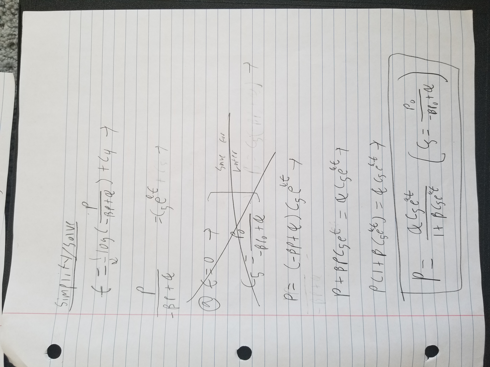

# Math 4610 Tasksheet 5
### Jacob Fitzgerald (A02261889)

## Docs
https://jfitzusu.github.io/math4610/

## Code
https://github.com/jfitzusu/math4610/tree/main/Assignment05

https://github.com/jfitzusu/math4610/tree/main/mymodules

All test code can be found in the *tests.py* file in the assignment05 directory.

Implementation code can be found under the appropriate subdirectory in the mymodules directory.

## Running Tests
ALl test code can be run by navigating to the test directory, and exeucting the
```
python tests.py
```
command from a command line interface.

## Task 1
**Code for Implicit Euler Method:**
```
from newton import newton
import sympy

x = sympy.symbols('x')

'''
Function Which Implements the Implicit Euler Method to Approximate the Logistics Equation
a: The Growth Constant
b: The Limiting Constant
p0: Initial Value of the System at t=0
P: Maximum Value to Approximate
n: Number of Steps to Approximate
Returns: Two Arrays, One of Input Values and One of Output Values for the Approximated Logistics Equation
Notes: Uses Sympy Expressions, Which Slows Down Performance Quite a Bit
'''


def implicitLogistics(a, b, p0, P, n=100):
    h = P / n

    inputs = [0]
    outputs = [p0]

    t = 0
    p = p0
    for i in range(n):
        t += h
        inputs.append(t)
        implicitExpr = x - h * (a * x - b * x * x) - outputs[-1]
        p, converged = newton(implicitExpr, outputs[-1], 0.00001)
        outputs.append(p)

    return inputs, outputs

```
This function approximates the logistics function using the implicit euler method. It takes several paremetsrs
    * a: The Growth Constant
    * b: The Limiting Constant
    * p0: The Inital Value of the System at t=0
    * P: The Maximum Time Value to Approximate
    * n: The Number of Steps to Approximate

This code returns two arrays of points, one time values, and the other population values, which approximate the logistics equation with the given paremeters. 

It should be noted that this function uses newton's method to approximate the root for an equation, which means that our logistics equation gets reprente with a SymPy funciton, as seen in earlier documentation. This means that the performance of this method is honestly kind of slow, but the power of being able to computationally determine the derivative. 

**Code for Testing:**
```
def testImplicitLogistics(a, b, p0, P):
    print(f"    Testing the Implicit Euler Method on the Logistics Equation With a={a} b={b} p0={p0}")
    x, y = implicitLogistics(a, b, p0, P, 1000)
    print(f"       End Value: {y[-1]:.10f}")
    plt.plot(x, y)
    plt.title(f"Logistics Curve Approximation for alpha={a} beta={b} p0={p0} (Implicit)")
    plt.xlabel("Time")
    plt.ylabel("Population")
    plt.show()

...

print("Testing Implicit Euler Method")
print("-----------------------------")
testImplicitLogistics(0.2, 0.0005, 10.0, 100)
testImplicitLogistics(0.01, 0.0005, 10.0, 500)
testImplicitLogistics(2.0, 0.0005, 10.0, 10)
```

The code above calls our implicit euler approximation of the logistics equation on several different versions of it, graphs the result, and outputs the "convergence" value. 

**Testing Output:**
```
Testing Implicit Euler Method
-----------------------------
    Testing the Implicit Euler Method on the Logistics Equation With a=0.2 b=0.0005 p0=10.0
       End Value: 399.9999635825
    Testing the Implicit Euler Method on the Logistics Equation With a=0.01 b=0.0005 p0=10.0
       End Value: 19.8649354601
    Testing the Implicit Euler Method on the Logistics Equation With a=2.0 b=0.0005 p0=10.0
       End Value: 3999.9964402688
```

**Graphs:**


We get convergence results very close to the predicted values of alpha/beta using this method, so it most likely works. Additionally, as we can see from the graphs, the curves look about right. Of course, this is a pretty qualitative analysis, so we can't say that this function is a good approximation just yet. We'll cover stricter testing in the next parts. 

## Task 2

**Derivation:**




**Code for Analytical Method:**

```
import math

'''
Function Which Analytically the Logistics Equation
a: The Growth Constant
b: The Limiting Constant
p0: Initial Value of the System at t=0
P: Maximum Value to Approximate
n: Number of Steps to Approximate
Returns: Two Arrays, One of Input Values and One of Output Values for the Exact Logistics Equation
Notes: Uses Sympy Expressions, Which Slows Down Performance Quite a Bit
'''


def analyticalLogistics(a, b, p0, P, n=100):
    h = P / n
    c = p0 / (-b * p0 + a)

    inputs = [0]
    outputs = [p0]

    t = 0
    p = p0
    for i in range(n):
        t += h
        inputs.append(t)
        p = (a * c * math.e ** (a * t)) / (1 + b * c * math.e ** (a * t))
        outputs.append(p)

    return inputs, outputs
```
This function calculates the exact (within the error of floating point arithmatic) value of the logistics equation at a series of points. It excepts serveral parameters:
    * a: The Growth Constant
    * b: The Limiting Constant
    * p0: The Inital Value of the System at t=0
    * P: The Maximum Time Value to Approximate
    * n: The Number of Steps to Approximate

This code returns two arrays of points, one time values, and the other population values, which approximate the logistics equation with the given paremeters. 

The method for calculated the exact value of the logistics equation is found in the derivation above, where the logistics equation is integrated using seperation of variables, integration by parts, and substitution in order to get an exact equation. While this is the "exact" value of the logistics equation, it's still limited by machine precision, so it's not quite fair to call it perfect. 

**Code for Testing:**
```
def testAnalyticLogistics(a, b, p0, P):
    print(f"    Testing the Analytical Method on the Logistics Equation With a={a} b={b} p0={p0}")
    x, y = analyticalLogistics(a, b, p0, P, 1000)
    print(f"       End Value: {y[-1]:.10f}")
    plt.plot(x, y)
    plt.title(f"Logistics Curve EXACT for alpha={a} beta={b} p0={p0}")
    plt.xlabel("Time")
    plt.ylabel("Population")
    plt.show()

...

print("Testing Analytical Method")
print("-----------------------------")
testAnalyticLogistics(0.2, 0.0005, 10.0, 100)
testAnalyticLogistics(0.01, 0.0005, 10.0, 500)
testAnalyticLogistics(2.0, 0.0005, 10.0, 10)
```
This code calls our analytical equation on a series of different logistics equations, graphs the results, and outputs the "convergence" value. 

**Testing Output:**
```
Testing Analytical Method
-----------------------------
    Testing the Analytical Method on the Logistics Equation With a=0.2 b=0.0005 p0=10.0
       End Value: 399.9999678460
    Testing the Analytical Method on the Logistics Equation With a=0.01 b=0.0005 p0=10.0
       End Value: 19.8661429815
    Testing the Analytical Method on the Logistics Equation With a=2.0 b=0.0005 p0=10.0
       End Value: 3999.9967104015
```

**Graphs:**


Our function outputs very similar values, which line up with our expected carrying capacities of alpha/beta, so it's a good sign that our code actually works. Additionally, the curves do look about right again, which should mean that our method works, but isn't a gaurentee. In order to make sure, we'll have to compare it to our explicit approximation, which we know works.  

## Task 3

**Code for Comparison:**
```
def compareLogistics(a, b, p0, P):
    print(f"    Comparing Logistics Equation Methods With a={a} b={b} p0={p0}")
    x0, y0 = explicitEulerLogistic(a, b, p0, P, 1000)
    print(f"       End Value Explicit: {y0[-1]:.10f}")
    x1, y1 = implicitLogistics(a, b, p0, P, 1000)
    print(f"       End Value Implicit: {y1[-1]:.10f}")
    x2, y2 = analyticalLogistics(a, b, p0, P, 1000)
    print(f"       End Value Analytical: {y2[-1]:.10f}")

    plt.plot(x0, y0, color='r', label="Explicit Euler Method")
    plt.plot(x1, y1, color='g', label="Implicit Euler Method")
    plt.plot(x2, y2, color='b', label="Analytical Method")
    plt.title(f"Comparison of Logistics Equation Methods with alpha={a} beta={b} p0={p0}")
    plt.xlabel("Time")
    plt.ylabel("Population")
    plt.legend()
    plt.show()

...

print("Comparing Methods")
print("-----------------")
compareLogistics(0.2, 0.0005, 10.0, 100)
compareLogistics(0.01, 0.0005, 10.0, 500)
compareLogistics(2.0, 0.0005, 10.0, 10)
```

In this code, we use each of our methods to approximate a logistics equation, using our explicit euler approximation from the last task sheet as well as the implicit euler and analytical methods from this task sheet. All of the methods are then graphed together on the same plot for comparison purposes, and the function reports on each "convergence" value as it goes. 

**Testing Output:**
```
Comparing Methods
-----------------
    Comparing Logistics Equation Methods With a=0.2 b=0.0005 p0=10.0
       End Value Explicit: 399.9999717087
       End Value Implicit: 399.9999635825
       End Value Analytical: 399.9999678460
    Comparing Logistics Equation Methods With a=0.01 b=0.0005 p0=10.0
       End Value Explicit: 19.8673467943
       End Value Implicit: 19.8649354601
       End Value Analytical: 19.8661429815
    Comparing Logistics Equation Methods With a=2.0 b=0.0005 p0=10.0
       End Value Explicit: 3999.9969677417
       End Value Implicit: 3999.9964402688
       End Value Analytical: 3999.9967104015

```

**Graphs:**


As we can see, our functions all generate extremley close "convergence" values, which all line up with the expected carrying capacity. Additionally, when graphed, it's actually almost impossible to see any of the additional lines. This is because all of our methods produce results so close that you can't distinguish them on a large scale graph. This is an extremley good sign, as it means the analytical and implicit approaches from this task sheet match up with the explicit method from the last, which we know to work. This pretty much proves that our approximations are accurate. 


## Task 4

**Code for Hybrid Composite Trapezoidal Rule:**
```
'''
Approximates an Integral Using the Composite Trapezoidal Rule
f: Function to Integrate
a: Start of Interval
b: End of Interval
n: Number of Subintervals to Approximate With
'''
def trapezoid(f, a, b, n=100):
    h = (b - a) / n

    sol = 0
    x = a
    for i in range(n - 1):
        x += h
        sol += f(x)

    sol += (f(a) + f(b)) / 2
    sol *= h
    return sol


```
This function approximates the integral of a funciton over a defined integral. It accepts several paremters:
    * f: The Function to Integrate, a Python Lambda
    * a: The Start of the Interval
    * b: The End of the Interval
    * n: The Number of Subintervals to Use

It returns the approximate value of the integral of f from a to b.

It should be noted that this code uses the composite version of the trapezoidal rule. This means that, instead of calculating the area of a trapazoid for each subinterval, it combines adjacent function evaluations to lead to a much more efficient process. This means that it only needs n + 1 function evaluations, as opposed to the \~2n needed for the normal trapezoidal rule.  

**Code for Testing:**
```
def testTrapezoid(f, fString, a, b, n):
    print(f"    Testing Trapezoidal Approximation of f(x)={fString} from a={a} to b={b} with {n} Subintervals")
    res = trapezoid(f, a, b, n)
    print(f"        Result: {res}")

...

print("Testing Trapezoidal Approximation")
print("_________________________________")
f = lambda x: math.e ** (-(x * x))
fString = "e ^ (- x ^ 2)"
testTrapezoid(f, fString, 0, math.pi / 4, 2)
testTrapezoid(f, fString, 0, math.pi / 4, 4)
testTrapezoid(f, fString, 0, math.pi / 4, 8)
testTrapezoid(f, fString, 0, math.pi / 4, 16)
```

In this code, the integral of the function f(x) = e ^ (- (x ^ 2)) is approximated from 0 to pi / 4, over a varying number of subintervals. The resultant approximation is reported to the console.  

**Testing Output:**
```
Testing Trapezoidal Approximation
_________________________________
    Testing Trapezoidal Approximation of f(x)=e ^ (- x ^ 2) from a=0 to b=0.7853981633974483 with 2 Subintervals
        Result: 0.6388862805734845
    Testing Trapezoidal Approximation of f(x)=e ^ (- x ^ 2) from a=0 to b=0.7853981633974483 with 4 Subintervals
        Result: 0.6471507696813964
    Testing Trapezoidal Approximation of f(x)=e ^ (- x ^ 2) from a=0 to b=0.7853981633974483 with 8 Subintervals
        Result: 0.6491991053630145
    Testing Trapezoidal Approximation of f(x)=e ^ (- x ^ 2) from a=0 to b=0.7853981633974483 with 16 Subintervals
        Result: 0.6497100964398593
```

As we can see, as the number of subintervals increases, the approximation seems to converge to some value. If I had to take a guess, I'd say it's converging to 0.65, but it's honestly hard to tell. I messed around for a bit, trying to divide the approximation with a very high number of subintervals by certain mathmatical constants, such as e, pi, or sqrt(2), but it doesn't actually seem to be related to any of them. So overall, I wouldn't say there's anything special about the number this approximation is converging to. 


## Task 5

**Code for Simpson Method:**
```
import math

'''
Approximates an Integral Using the Composite Simpsons Rule
f: Function to Integrate
a: Start of Interval
b: End of Interval
n: Number of Subintervals to Approximate With
'''
def simpson(f, a, b, n=100):
    h = (b - a) / n
    sum2 = 0
    sum4 = 0
    x = a
    for i in range(math.floor(n // 2) - 1):
        x += h
        sum4 += f(x)
        x += h
        sum2 += f(x)

    sum4 += f(x + h)
    sum2 *= 2
    sum4 *= 4

    sol = (sum2 + sum4 + f(a) + f(b)) * (h / 3)
    return sol
```
This function approximates the integral of a funciton over a defined integral using Simpson's Rule. It accepts several paremters:
    * f: The Function to Integrate, a Python Lambda
    * a: The Start of the Interval
    * b: The End of the Interval
    * n: The Number of Subintervals to Use

It returns the approximate value of the integral of f from a to b.

It should be noted that this code uses the composite version of Simpson's Rule. This means that, instead of evaluating f(x) at multiple points for each interval, it groups evaluations together, and then applies mathematical opperations to them as a group. This means that we only need n + 1 function evaluations, as opposed to the \~3n needed by the normal version of the rule. This also means we save a few cpu cycles when calculating values as we avoid repeated multiplication operations. 

**Code for Testing:**

```
def testSimpsons(f, fString, a, b, n):
    steps = 4
    H = []
    E = []
    ref = simpson(f, a, b, 2 ** n * 4)
    for i in range(n):
        H.append((b - a) / steps)
        print(f"    Testing Trapezoidal Approximation of f(x)={fString} from a={a} to b={b} with {steps} Subintervals")
        res = simpson(f, a, b, steps)
        E.append(math.fabs(res - ref))
        print(f"        Result: {res}")
        steps *= 2


    hLog = [math.log(h) for h in H]
    eLog = [math.log(e) for e in E]
    plt.plot(hLog, eLog)
    plt.title(f"Convergence Study of f(x)={fString} Over Varying Step Sizes")
    plt.xlabel("Step Size (log)")
    plt.ylabel("Error (log)")
    plt.show()

    slope1, intercept1, _, _, _ = stats.linregress(hLog, eLog)
    print(f"    Equation For Error Using Scipy Linear Regression: E = {math.exp(intercept1):0.4f} * h ^ {slope1:.4f}")

...

print("Testing Simpson's Approximation")
print("-------------------------------")
f = lambda x: math.e ** (-(x * x))
fString = "e ^ (- x ^ 2)"
testSimpsons(f, fString, 0, math.pi / 4, 8)
```

This code applies our Simpson method to the function f(x) = e ^ (- (x ^ 2)) over the interval 0 to pi / 4, using a varying step size. It starts out using 4 subintervals, and increases all the way to 512, doubling the number each time. This means that our step size get's halved each time. It collects the results from each approximation, extimates the error using a k + 1 th approximation, and then tabulates and graphs the results. In this case, we use a log/log graph, as we expect our erro to be a function of h to some power. Using SciPy (we could also use our linear regression code from the last assignment), it then estimates the equation for error as a function of step size, h.

**Testing Output:**
```
Testing Simpson's Approximation
-------------------------------
    Testing Trapezoidal Approximation of f(x)=e ^ (- x ^ 2) from a=0 to b=0.7853981633974483 with 4 Subintervals
        Result: 0.6499055993840337
    Testing Trapezoidal Approximation of f(x)=e ^ (- x ^ 2) from a=0 to b=0.7853981633974483 with 8 Subintervals
        Result: 0.6498818839235538
    Testing Trapezoidal Approximation of f(x)=e ^ (- x ^ 2) from a=0 to b=0.7853981633974483 with 16 Subintervals
        Result: 0.6498804267988076
    Testing Trapezoidal Approximation of f(x)=e ^ (- x ^ 2) from a=0 to b=0.7853981633974483 with 32 Subintervals
        Result: 0.6498803361175071
    Testing Trapezoidal Approximation of f(x)=e ^ (- x ^ 2) from a=0 to b=0.7853981633974483 with 64 Subintervals
        Result: 0.6498803304559893
    Testing Trapezoidal Approximation of f(x)=e ^ (- x ^ 2) from a=0 to b=0.7853981633974483 with 128 Subintervals
        Result: 0.6498803301022391
    Testing Trapezoidal Approximation of f(x)=e ^ (- x ^ 2) from a=0 to b=0.7853981633974483 with 256 Subintervals
        Result: 0.6498803300801318
    Testing Trapezoidal Approximation of f(x)=e ^ (- x ^ 2) from a=0 to b=0.7853981633974483 with 512 Subintervals
        Result: 0.6498803300787487
    Equation For Error Using Scipy Linear Regression: E = 0.0173 * h ^ 4.0107
```

**Graph:**


In this case, the power of h is approximatley 4, this is confirmed by looking at our log/log graph, which has a similar slope. This makes sense, as the Simpson method is a "higher order" approximation than the trapezoidal rule, so it could realistically have much better convergence. 