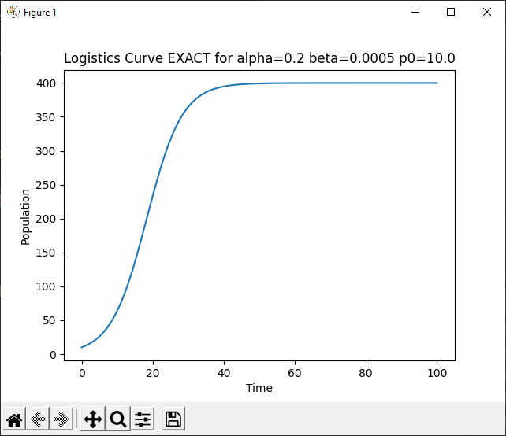
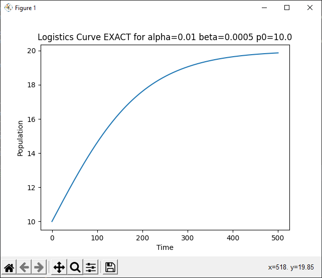
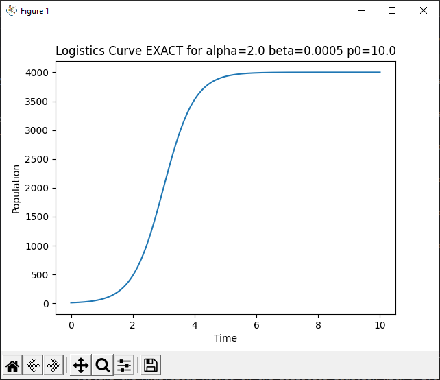

# Analytical Algorithm (For the Logistics Equation)

**Routine Name:** analyticalLogistics

**Author:** Jacob Fitzgerald

**Language:** Python. This function can be used by including the import statment in your Python header:
```
from analyticallogistics import analyticalLogistics
```

**Description/Purpose:** This function uses the analytical solution to the logistics equation to calculate exact values for it. This solution was derived using advanced integration techniques, and should produce results that are accurate within machine/roundoff error. 

The logistics equation is defined:
```
dp/dt = ap - bp^2
p(0) = p0
```

**Input:**
### *a:* 
  * Data Type: float
  * Valid Input: [float.min, float.max]
  * Description: The alpha value of the logistics equation

### *b:* 
  * Data Type: float
  * Valid Input: [float.min, float.max]
  * Description: The beta value of the logistics equation

### *p0:* 
  * Data Type: float
  * Valid Input: [float.min, float.max]
  * Description: The initial value of the ivp

### *P:* 
  * Data Type: float
  * Valid Input: (0, float.max]
  * Description: The maximum time to calculate a value at for the logistic equation

### *n:* 
  * Data Type: int
  * Valid Input: (0, int.max]
  * Default Value: 100
  * Description: The number of points to calculate


**Output:** 
### *inputs, outputs:*
  * Data Type: float[], float[]
  * Possible Values: [float.min, float.max][], [float,min, float.max][]
  * Description: The time values used for the calculation, and the values of the logistic equation at those time values. inputs[i], outputs[i] represents a singular x, y point

**Usage/Example:**

After Importing the Function, You Can Call it In Your Code Like So:

```
def testAnalyticLogistics(a, b, p0, P):
    print(f"    Testing the Analytical Method on the Logistics Equation With a={a} b={b} p0={p0}")
    x, y = analyticalLogistics(a, b, p0, P, 1000)
    print(f"       End Value: {y[-1]:.10f}")
    plt.plot(x, y)
    plt.title(f"Logistics Curve EXACT for alpha={a} beta={b} p0={p0}")
    plt.xlabel("Time")
    plt.ylabel("Population")
    plt.show()

print("Testing Analytical Method")
print("-----------------------------")
testAnalyticLogistics(0.2, 0.0005, 10.0, 100)
testAnalyticLogistics(0.01, 0.0005, 10.0, 500)
testAnalyticLogistics(2.0, 0.0005, 10.0, 10)
```

This code sets up and graphs a variety of logistics equations using our function. It also prints the last (hopefully convergent) value to the console.

Console Output:
```
Testing Analytical Method
-----------------------------
    Testing the Analytical Method on the Logistics Equation With a=0.2 b=0.0005 p0=10.0
       End Value: 399.9999678460
    Testing the Analytical Method on the Logistics Equation With a=0.01 b=0.0005 p0=10.0
       End Value: 19.8661429815
    Testing the Analytical Method on the Logistics Equation With a=2.0 b=0.0005 p0=10.0
       End Value: 3999.9967104015
```





**Implementation/Code:** The Following is the Code for analyticalLogistics()
```
def analyticalLogistics(a, b, p0, P, n=100):
    h = P / n
    c = p0 / (-b * p0 + a)

    inputs = [0]
    outputs = [p0]

    t = 0
    p = p0
    for i in range(n):
        t += h
        inputs.append(t)
        p = (a * c * math.e ** (a * t)) / (1 + b * c * math.e ** (a * t))
        outputs.append(p)

    return inputs, outputs
```
**Last Modified:** November/2022