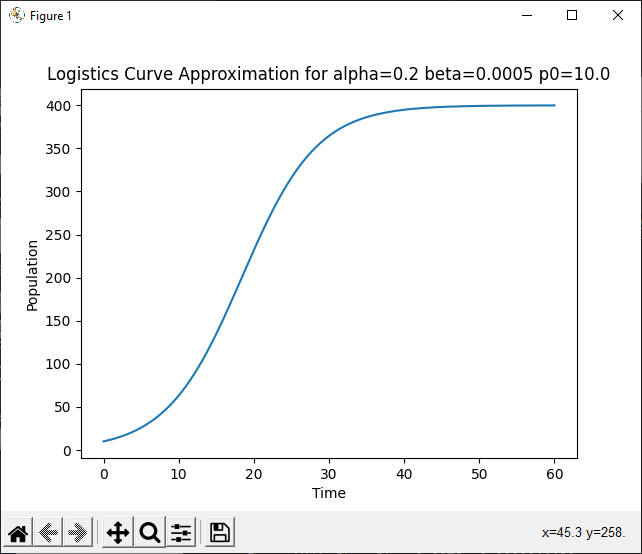

# Explicit Euler Algorithm (For the Logistics Equation)

**Routine Name:** explicitEulerLogistic

**Author:** Jacob Fitzgerald

**Language:** Python. This function can be used by including the import statment in your Python header:
```
from expliciteulerlogistic import explicitEulerLogistic
```

**Description/Purpose:** This function uses the explicit euler method to approximate the values of a function. This requires you to know both the derivative and a starting value. As this function only works for the logistics equation, we already know the predefined derivative, and only need to be given a starting value. This function works by using a point to approximate the next point by applying essentially the reverse of the limit definition of the derivative. This means that the step size must remain small in order to mantain accuracy.

The logistics equation is defined:
```
dp/dt = ap - bp^2
p(0) = p0
```

**Input:**
### *a:* 
  * Data Type: float
  * Valid Input: [float.min, float.max]
  * Description: The alpha value of the logistics equation

### *b:* 
  * Data Type: float
  * Valid Input: [float.min, float.max]
  * Description: The beta value of the logistics equation

### *p0:* 
  * Data Type: float
  * Valid Input: [float.min, float.max]
  * Description: The initial value of the ivp

### *P:* 
  * Data Type: float
  * Valid Input: (0, float.max]
  * Description: The maximum time to approximate a value at for the logistic equation

### *n:* 
  * Data Type: int
  * Valid Input: (0, int.max]
  * Default Value: 100
  * Description: The number of points to calculate


**Output:** 
### *inputs, outputs:*
  * Data Type: float[], float[]
  * Possible Values: [float.min, float.max][], [float,min, float.max][]
  * Description: The time values used for the approximation, and the values of the logistic equation at those time values. inputs[i], outputs[i] represents a singular x, y point

**Usage/Example:**

After Importing the Function, You Can Call it In Your Code Like So:

```
def testLogistic(a, b, p0, end):
    print(f"Approximating Logistics Equation alpha={a} beta={b} p0={p0}")
    x, y = explicitEulerLogistic(a, b, p0, end, 1000)
    print(f"   End Value: {y[-1]:.10f}")
    plt.plot(x, y)
    plt.title(f"Logistics Curve Approximation for alpha={a} beta={b} p0={p0}")
    plt.xlabel("Time")
    plt.ylabel("Population")
    plt.show()

testLogistic(0.2, 0.0005, 10.0, 60)
```

This code calls our function for a logistic equation where a=0.2, b=0.0005, p0=10.0, for 60 steps. It then takes the results, and uses matplotlib to graph them. 

Console Output:



**Implementation/Code:** The Following is the Code for explicitEulerLogistic()
```
def explicitEulerLogistic(a, b, p0, P, n=100):
    h = P / n
    deriv = lambda x: a * x - b * x * x

    inputs = [0]
    outputs = [p0]

    t = 0
    p = p0
    for i in range(n):
        t += h
        inputs.append(t)
        p = p + h * deriv(p)
        outputs.append(p)

    return inputs, outputs
```
**Last Modified:** November/2022