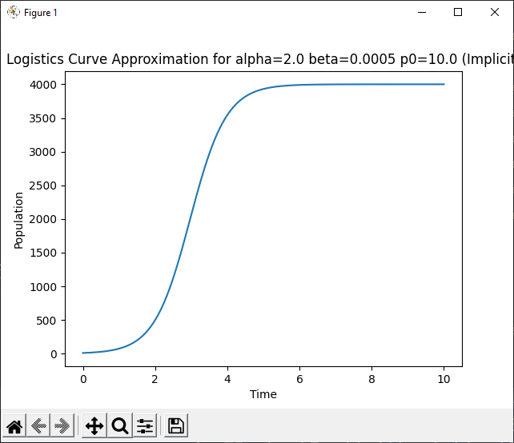

# Implicit Euler Algorithm (For the Logistics Equation)

**Routine Name:** implicitLogistics

**Author:** Jacob Fitzgerald

**Language:** Python. This function can be used by including the import statment in your Python header:
```
from implicitlogistics import implicitLogistics
```

**Description/Purpose:** This function uses the implicit euler method to approximate the values of a function. This requires you to know both the derivative and a starting value. As this function only works for the logistics equation, we already know the predefined derivative, and only need to be given a starting value. This function works by using a point to approximate the itself by applying essentially the reverse of the limit definition of the derivative. This sets up a root finding problem, which newton's method is used to solve, as we already know the derivative. This means that it's possible to maintian accuracy with large step sizes, at the cost of much more work per step compared to the explicit method. 

The logistics equation is defined:
```
dp/dt = ap - bp^2
p(0) = p0
```

**Input:**
### *a:* 
  * Data Type: float
  * Valid Input: [float.min, float.max]
  * Description: The alpha value of the logistics equation

### *b:* 
  * Data Type: float
  * Valid Input: [float.min, float.max]
  * Description: The beta value of the logistics equation

### *p0:* 
  * Data Type: float
  * Valid Input: [float.min, float.max]
  * Description: The initial value of the ivp

### *P:* 
  * Data Type: float
  * Valid Input: (0, float.max]
  * Description: The maximum time to approximate a value at for the logistic equation

### *n:* 
  * Data Type: int
  * Valid Input: (0, int.max]
  * Default Value: 100
  * Description: The number of points to calculate


**Output:** 
### *inputs, outputs:*
  * Data Type: float[], float[]
  * Possible Values: [float.min, float.max][], [float,min, float.max][]
  * Description: The time values used for the approximation, and the values of the logistic equation at those time values. inputs[i], outputs[i] represents a singular x, y point

**Usage/Example:**

After Importing the Function, You Can Call it In Your Code Like So:

```
def testImplicitLogistics(a, b, p0, P):
    print(f"    Testing the Implicit Euler Method on the Logistics Equation With a={a} b={b} p0={p0}")
    x, y = implicitLogistics(a, b, p0, P, 1000)
    print(f"       End Value: {y[-1]:.10f}")
    plt.plot(x, y)
    plt.title(f"Logistics Curve Approximation for alpha={a} beta={b} p0={p0} (Implicit)")
    plt.xlabel("Time")
    plt.ylabel("Population")
    plt.show()

print("Testing Implicit Euler Method")
print("-----------------------------")
testImplicitLogistics(0.2, 0.0005, 10.0, 100)
testImplicitLogistics(0.01, 0.0005, 10.0, 500)
testImplicitLogistics(2.0, 0.0005, 10.0, 10)

```

This code sets up and graphs a variety of logistics equations using our function. It also prints the last (hopefully convergent) value to the console.


Console Output:
```
Testing Implicit Euler Method
-----------------------------
    Testing the Implicit Euler Method on the Logistics Equation With a=0.2 b=0.0005 p0=10.0
       End Value: 399.9999635825
    Testing the Implicit Euler Method on the Logistics Equation With a=0.01 b=0.0005 p0=10.0
       End Value: 19.8649354601
    Testing the Implicit Euler Method on the Logistics Equation With a=2.0 b=0.0005 p0=10.0
       End Value: 3999.9964402688
```





**Implementation/Code:** The Following is the Code for implicitLogistics()
```
def implicitLogistics(a, b, p0, P, n=100):
    h = P / n

    inputs = [0]
    outputs = [p0]

    t = 0
    p = p0
    for i in range(n):
        t += h
        inputs.append(t)
        implicitExpr = x - h * (a * x - b * x * x) - outputs[-1]
        p, converged = newton(implicitExpr, outputs[-1], 0.00001)
        outputs.append(p)

    return inputs, outputs
```
**Last Modified:** November/2022